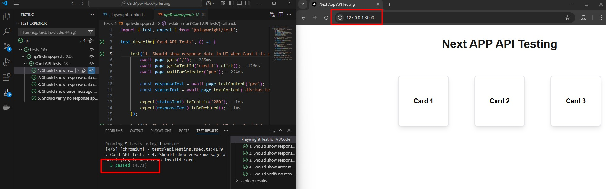

# Next.js Card App - Mock API Testing

## Overview

This project is a **Next.js application** that provides a mock API for testing card-based responses. It includes a simple frontend to interact with API endpoints and validate responses.



## Features

- **Mock API Endpoints** to fetch card details.
- **Frontend UI** to display card data.
- **Playwright Tests** for API and UI validation.
- **Error Handling** for invalid card IDs.

## Installation

### Prerequisites

- **Node.js** (>=16.8.0 recommended)
- **npm** or **yarn**

### Clone the Repository

```sh
git clone https://github.com/yourusername/next-app-api-qa.git
cd next-app-api-qa
```

### Install Dependencies

```sh
npm install  # or yarn install
```

## Running the Application

### Start the Development Server

```sh
npm run dev  # or yarn dev
```

The app will be available at `http://localhost:3000`

## API Endpoints

### Get Card by ID

```sh
GET /api/cards/[id]
```

#### Example Response:

```json
{
  "id": "1",
  "status": 200,
  "message": "Response from Card 1",
  "timestamp": "2025-01-27T12:00:00.000Z"
}
```

### Error Response (Invalid ID)

```json
{
  "error": "Card not found"
}
```

## Running Tests

### Playwright Tests

Run Playwright tests to validate UI and API:

```sh
npx playwright test
```

## Folder Structure

```
next-app-api-qa/
├── public/        # Static assets
├── src/           # Source code
│   ├── app/       # Next.js App Router
│   │   ├── api/cards/[id].ts  # Mock API handler
│   │   ├── page.tsx           # Main UI page
│   ├── tests/     # Playwright tests
├── package.json   # Project dependencies
├── README.md      # Project documentation
```

## Contributing

Feel free to submit issues or pull requests to improve the project.

## License

MIT License. See `LICENSE` file for details.

